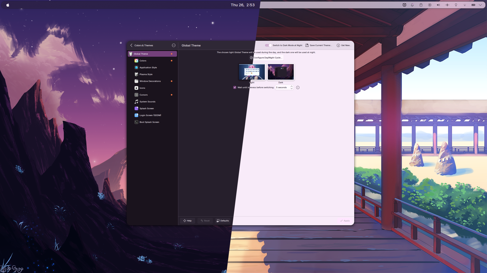

# Dotfiles



Personal KDE Plasma 6 dotfiles for a tiling-focused desktop on CachyOS. Config
files are managed with [GNU Stow](https://www.gnu.org/software/stow/) and the
full Plasma environment (themes, KWin rules, shortcuts, plasmoids) is
snapshotted and restored via [konsave](https://github.com/Prayag2/konsave).

## Quick Start

### 1. Install Required Tools

- [`stow`](https://www.gnu.org/software/stow/) — symlinks config packages into
  `$HOME`
- [`konsave`](https://github.com/Prayag2/konsave) — restores the Plasma
  environment (`pip install konsave`)

### 2. Install Required Plasma Packages

These need to be present before applying the konsave profile. On CachyOS/Arch
(see [Bootstrap](#bootstrap) for chaotic-AUR setup):

```bash
yay -S darkly-bin kwin-effect-rounded-corners-git kwin-scripts-krohnkite-git colloid-icon-theme-git plasma6-applets-wallhaven-reborn-git
```

For other distros, install from source:

| Component                         | Source                                                              |
| --------------------------------- | ------------------------------------------------------------------- |
| Darkly — Qt application style     | [GitHub](https://github.com/Bali10050/Darkly)                       |
| KDE Rounded Corners — KWin effect | [GitHub](https://github.com/matinlotfali/KDE-Rounded-Corners)       |
| Krohnkite — tiling KWin script    | [Codeberg](https://codeberg.org/anametologin/Krohnkite)             |
| Colloid Icon Theme — icons        | [GitHub](https://github.com/vinceliuice/Colloid-icon-theme)         |
| Wallhaven wallpaper plugin        | [GitHub](https://github.com/Blacksuan19/plasma-wallpaper-wallhaven-reborn/) |

### 3. Clone and Run

```bash
git clone --recurse-submodules https://github.com/Blacksuan19/Dotfiles ~/.dotfiles
cd ~/.dotfiles
bash install.sh
```

`install.sh` stows all config packages and then prompts whether to apply the
`Plasma-Round` konsave profile. Answer `y` for a fully configured system in one
shot.

> **Fresh machine?** Run `~/.local/bin/bootstrap.sh` first — it sets up git
> identity, chaotic-AUR, and installs all packages via `yay`. See
> [Bootstrap](#bootstrap) below.

## What the Plasma-Round Profile Installs

The `Plasma-Round` konsave profile is a full snapshot of the Plasma environment.
Applying it restores everything below. The required packages listed in Quick
Start are the only things that need to be installed separately.

### Themes & Visuals

| Component              | Theme / Package                                                                 |
| ---------------------- | ------------------------------------------------------------------------------- |
| Global theme           | `Dark Mode` / `Light Mode` (custom, toggle between them)                        |
| Plasma desktop theme   | `Utterly-Round`                                                                 |
| Look-and-feel packages | `Dark Mode`, `Light Mode`                                                       |
| Window decorations     | KWin is configured for `Darkly`; no Aurorae themes are bundled in the profile   |
| Color schemes          | `BreezeDarkTint`, `BreezeLightTint`                                             |
| Kvantum themes         | None                                                                            |
| GTK 3 & GTK 4 themes   | `Breeze`                                                                        |
| Icons                  | GTK is configured to use `Colloid-Dark` (icon pack not bundled in this profile) |
| Cursor theme           | `Layan-white-cursors` (configured in GTK / look-and-feel defaults)              |
| Application style      | `Darkly`                                                                        |
| Fonts                  | `Inter` UI and `JetBrainsMonoNL Nerd Font` monospace                            |

### KWin Scripts & Effects

| Name                           | Purpose                                       |
| ------------------------------ | --------------------------------------------- |
| Krohnkite                      | Tiling window manager script                  |
| Rounded Corners                | Rounded window corners                        |
| `switch-to-previous-desktop`   | Jump back to last desktop using `Super + Tab` |
| `kwin4_effect_geometry_change` | Smooth window geometry animations             |

### Plasmoids

| Name                 | Purpose                    |
| -------------------- | -------------------------- |
| com.dv.fokus         | Focus/productivity widget  |
| org.kde.latte.spacer | Panel spacer               |
| Wallhaven            | Wallhaven wallpaper plugin |

### KDE Config Files Restored

The profile captures and restores these config files from `~/.config/`:

| File                                      | What it controls                                        |
| ----------------------------------------- | ------------------------------------------------------- |
| `kdeglobals`                              | Global KDE settings (fonts, color scheme, widget style) |
| `kglobalshortcutsrc`                      | All global keyboard shortcuts                           |
| `kwinrc`                                  | KWin compositor and window manager settings             |
| `kwinrulesrc`                             | Per-window KWin rules (e.g. hide titlebar)              |
| `plasmarc`                                | Plasma shell settings                                   |
| `plasmashellrc`                           | Panel and desktop layout                                |
| `plasma-org.kde.plasma.desktop-appletsrc` | Plasmoid configuration                                  |
| `breezerc`                                | Breeze window decoration settings                       |
| `kcminputrc`                              | Mouse, touchpad, and cursor settings                    |
| `kscreenlockerrc`                         | Lock screen settings                                    |
| `ksplashrc`                               | Splash screen theme                                     |
| `ksmserverrc`                             | Session manager settings                                |
| `krunnerrc`                               | KRunner settings                                        |
| `klipperrc`                               | Clipboard manager settings                              |
| `konsolerc`                               | Konsole terminal settings                               |
| `plasmanotifyrc`                          | Notification settings                                   |
| `spectaclerc`                             | Screenshot tool settings                                |
| `systemsettingsrc`                        | System Settings state                                   |
| `xdg-desktop-portal-kderc`                | XDG desktop portal settings                             |
| `plasma-localerc`                         | Locale and language settings                            |
| `kconf_updaterc`                          | KDE config migration tracking                           |
| `kded5rc`                                 | KDE daemon settings                                     |
| `gtk-3.0/`                                | GTK 3 theme config (Breeze)                             |
| `gtk-4.0/`                                | GTK 4 theme config (Breeze)                             |

### Color System

The setup uses the active wallpaper's colors to tint the entire desktop — Qt and
GTK apps alike pick up the palette automatically through KDE's color scheme
integration. Switching wallpapers updates the accent color system-wide with no
manual intervention.

For code editors and the terminal,
[Ayu](https://github.com/ayu-theme/ayu-colors) is used as the color scheme:

| Mode  | Theme     | Used by                  |
| ----- | --------- | ------------------------ |
| Light | Ayu Light | VS Code, Ghostty, Neovim |
| Dark  | Ayu Dark  | VS Code, Ghostty, Neovim |

Both themes switch automatically with the system light/dark mode.

### Light/Dark Switching

The profile ships two custom global themes — `Dark Mode` and `Light Mode` — that
can be toggled manually via System Settings → Global Theme, or wired to Plasma's
automatic light/dark switching schedule.

## Stow Packages

Each top-level directory (except `screens/`) is a stow package that mirrors
`$HOME`. `install.sh` discovers and stows them automatically.

| Package     | Stowed to                      | Contents                                                   |
| ----------- | ------------------------------ | ---------------------------------------------------------- |
| `zsh/`      | `~/`                           | `.zshrc`, `.zsh/` (aliases, exports, config, znap plugins) |
| `tmux/`     | `~/`                           | `.tmux.conf`, auto light/dark theme watch scripts          |
| `nvim/`     | `~/.config/nvim/`              | Neovim config (git submodule)                              |
| `ghostty/`  | `~/.config/ghostty/`           | Ghostty terminal config                                    |
| `starship/` | `~/.config/`                   | `starship.toml` — shell prompt config                      |
| `mpv/`      | `~/.config/mpv/`               | MPV config                                                 |
| `fusuma/`   | `~/.config/fusuma/`            | Touchpad gesture config                                    |
| `systemd/`  | `~/.config/systemd/`           | User services (alist webdav mount)                         |
| `scripts/`  | `~/.local/bin/`               | User commands (bootstrap, alist-handler, plasma2telegram-watch, etc.) |
| `desktop/`  | `~/.local/share/applications/` | XDG desktop entries                                        |
| `konsave/`  | `~/.config/konsave/`           | Plasma-Round konsave profile                               |

## Bootstrap

Only needed on a fresh machine, run once before `install.sh`:

```bash
~/.local/bin/bootstrap.sh
```

It handles:

- Interactive git identity setup + sane git defaults (delta, GPG signing)
- Chaotic-AUR setup
- Package installation via `yay` from the repo-owned package list

The package list lives at `tools/bootstrap/packages-arch.txt` — edit it to
add/remove packages before running bootstrap.

## Media Protocol Handler

Handles `mpv://`, `vlc://`, and `potplayer://` protocol links by stripping the
scheme prefix and launching the appropriate local player with the real URL.
Originally set up for use with [AList](https://alist.nn.ci/) but works with any
site that fires these protocol schemes.

- `mpv://` and `potplayer://` links both open in MPV
- `vlc://` links open in VLC

Files:

- Handler script: `scripts/.local/bin/alist-handler` (stowed to
  `~/.local/bin/alist-handler`)
- Desktop entry: `desktop/.local/share/applications/alist-player.desktop`
  (stowed to `~/.local/share/applications/`)

## Keybindings

Tiling is handled by Krohnkite. All shortcuts are stored in the konsave profile
(`kglobalshortcutsrc`) and restored automatically.

| Key                    | Action                        |
| ---------------------- | ----------------------------- |
| Super                  | Launch KRunner                |
| Super + Enter          | Terminal                      |
| Super + W              | Browser                       |
| Super + F              | File manager                  |
| Super + Q              | Close window                  |
| Super + Space          | Toggle tiling layout          |
| Super + Shift + F      | Float window                  |
| Super + H/J/K/L        | Focus left/down/up/right      |
| Super + 1–9            | Switch to desktop N           |
| Super + Shift + 1–9    | Move window to desktop N      |
| Super + Tab            | Cycle recent desktops         |
| Super + Ctrl + H/J/K/L | Shrink window                 |
| Print                  | Full screenshot               |
| Shift + Print          | Area screenshot (Spectacle)   |
| Super + V              | Clipboard history             |
| Super + S              | Spotify                       |
| Super + T              | Telegram                      |
| Alt + Tab              | Cycle windows in all desktops |
