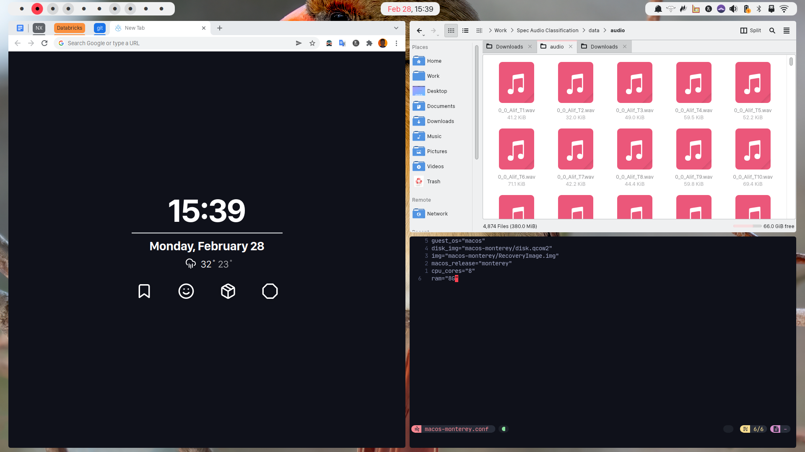

Personal configurations to make plasma a fully tiling desktop. With themes and
color schemes from
[Material ocean](https://github.com/material-ocean/material-ocean)

## Requirements

- A fresh KDE Plasma installation(check other branches for other dots)
- [Zsh](https://github.com/robbyrussell/oh-my-zsh/wiki/Installing-ZSH)
- [Prezto](https://github.com/sorin-ionescu/prezto)
- [Tmux](https://github.com/tmux/tmux)
- [Latte-Dock-git](https://aur.archlinux.org/packages/latte-dock-git/)
- required programs
  - ksuperkey (map meta to open krunner)
  - flameshot (for taking screenshots)
  - libinput-gestures (touchpad gestures)
  - unclutter (hide pointer when not in use)

### Fonts

> - [San Francesco Display](https://github.com/AppleDesignResources/SanFranciscoFont)
>   (UI font)
> - [JetBrains Mono Nerd Font](https://aur.archlinux.org/packages/nerd-fonts-jetbrains-mono/)
>   (Mono font)

## Installation

- `git clone --recurse-submodules https://github.com/Blacksuan19/Dotfiles ~/.dotfiles`
- `cd ~/.dotfiles`
- `bash install.sh` to install everything (including fonts).

### After Installation to do

- `bash once.sh` if on a clean install.
- set plasma themes.
- select `split beauty` layout for latte dock.
- import kwin rules and shortcuts under the `plasma` folder

## Plasma Extras

To achieve an exact replica of this setup there are some plasma settings that
need to be tweaked

- enable snap helper, desktop grid and desktop overview from desktop effects
- set hot corners for desktops overview and desktop grid (top right, top left)
- disable title bars for all windows
  [from here](https://www.reddit.com/r/unixporn/comments/4gez8w/hide_title_bars_in_kde_plasma_5/)
- [rounded corners add-on](https://github.com/matinlotfali/KDE-Rounded-Corners)
- move windows with alt and mouse (window behaviour -> window actions ->
  modifier key)
- set focus stealing to none, focuses new window on open (window behaviour ->
  focus -> focus stealing)
- set wallpaper to picture of the day from Wikimedia

## Shortcuts

For tiling, [Bismuth](https://github.com/Bismuth-Forge/bismuth) is used with
most of the shortcuts left as default, any changes done are mentioned below.

| key                      | function                                                   |
| ------------------------ | ---------------------------------------------------------- |
| win key(mod/super)       | launch krunner                                             |
| super + w                | launch browser (default is google chrome)                  |
| super + Enter            | launch terminal (default is kitty)                         |
| super + f                | launch file manager (default is dolphin)                   |
| super + q                | kill current window                                        |
| super + space            | switch between tiling and last used layout                 |
| super + shift + F        | make window float                                          |
| super + {h,j,k,l}        | focus the window on left, below, above, right respectively |
| super + Tab              | cycle through last used desktops (in order)                |
| super + 1-9              | go to desktop 1-9                                          |
| super + shift + 1-9      | move window to desktop number 1-9                          |
| super + ctrl + {h,j,k,l} | shrink window on given side                                |
| super + direction        | stick window at given direction corner                     |
| print                    | take a full screenshot                                     |
| print + shift            | launch flameshot area selection                            |
| super + v                | launch clipboard                                           |
| super + s                | launch spotify                                             |
| super + t                | launch telegram                                            |

## Screenshots

```txt
Global theme:   Breeze
Plasma Style:   Material Ocean
Color scheme:   Breeze with #ff4151 as accent color
Terminal:       Konsole
Terminal Theme: Material ocean
File Manager:   Dolphin
Icons:          Tela
Browser:        Google Chrome Stable
Docks:          Latte Dock (Split Beauty)
```



