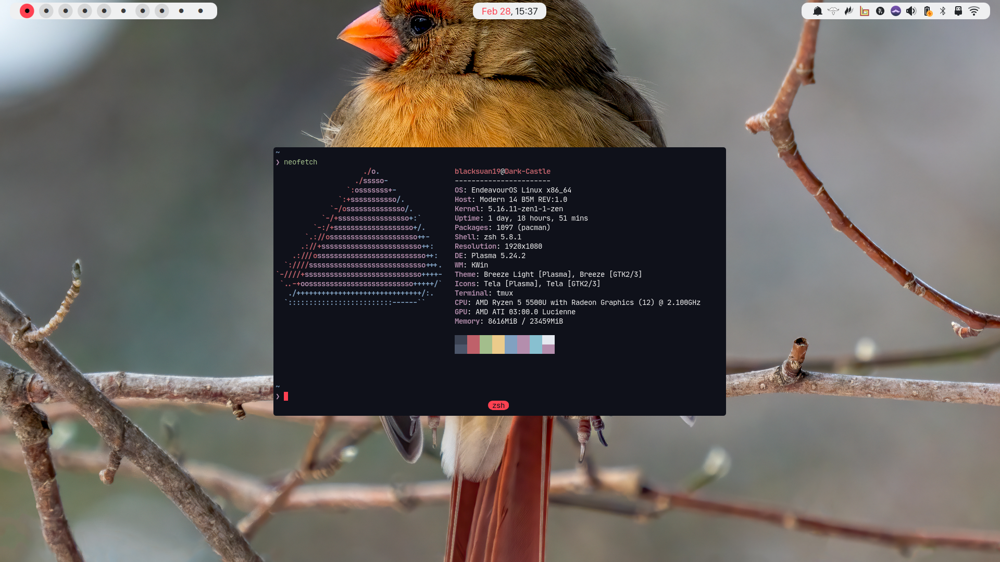

[Material Oceanized](https://github.com/material-ocean) configuration for Bspwm
and others.

## Requirements

- \*NIX system
- An already setup KDE Plasma installation(checkout
  [bspwm branch](https://github.com/Blacksuan19/Dotfiles/tree/bspwm) for bspwm
  only setup)
- [bspwm](https://wiki.archlinux.org/index.php/Bspwm)
- [sxhkd](https://wiki.archlinux.org/index.php/Sxhkd)
- [picom-joanburg](https://github.com/jonaburg/picom)
- [Zsh](https://github.com/robbyrussell/oh-my-zsh/wiki/Installing-ZSH)
- [Prezto](https://github.com/sorin-ionescu/prezto)
- [Tmux](https://github.com/tmux/tmux)
- [GTK Theme](https://github.com/material-ocean/Gtk-Theme)
- [Plasma Theme](https://github.com/material-ocean/Plasma-Theme)
- [Latte-Dock-git](https://aur.archlinux.org/packages/latte-dock-git/)
- required programs
  - pulseaudio (audio support)
  - dunst (notifcations daemon)
  - rofi (applications window)
  - ksuperkey (map meta to open rofi)
  - light (brightness control)
  - playerctl (control current player with media keys)
  - flameshot (for taking screenshots)
  - greenclip (clipboard history)

### Fonts

> - [San Francesco Display](https://github.com/AppleDesignResources/SanFranciscoFont)
>   (UI font)
> - [JetBrains Mono Nerd Font](https://aur.archlinux.org/packages/nerd-fonts-jetbrains-mono/)
>   (Mono font)

## Installation

- `git clone --recurse-submodules https://github.com/Blacksuan19/Dotfiles ~/.dotfiles`
- `cd ~/.dotfiles`
- `bash install.sh` to install everything (including fonts).

### After Installation to do

- `bash once.sh` if on a clean install.
- set plasma themes.
- select `split beauty` layout for latte dock.

## Customizations

### keyboard shortcuts

Shortcuts are controlled by sxhkd, since there are no default applications
handler you can set your default apps from sxhkd settings

| key                     | function                                                   |
| ----------------------- | ---------------------------------------------------------- |
| win key(mod/super)      | launch rofi                                                |
| super + F1              | show keyboard shortcuts in a window                        |
| super + w               | launch browser (default is google chrome)                  |
| super + Enter           | launch terminal (default is kitty)                         |
| super + f               | launch file manager (default is vifm)                      |
| super + shift + r       | reload sxhkd settings                                      |
| super + q               | kill current window                                        |
| super + g               | swap current window with the biggest                       |
| super + F9              | set window to tiled                                        |
| super + F10             | set window to floating                                     |
| super + F11             | set window to full screen                                  |
| super + {h,j,k,l}       | focus the window on left, below, above, right respectively |
| super + Tab             | focus last desktop                                         |
| super + shift + 1-9     | move window to desktop number 1-9                          |
| super + brackets        | focus window on left, right monitor                        |
| super + alt + {h,j,k,l} | expand window on given side                                |
| ctrl + alt + {h,j,k,l}  | contract window on given side                              |
| super + direction       | move floating window on given direction                    |
| print                   | take a full screenshot                                     |
| print + shift           | launch flameshot area selection                            |
| super + v               | launch clipboard                                           |
| super + s               | launch spotify                                             |
| super + t               | launch telegram                                            |

## Screenshots

#### Clean

#### Applications

